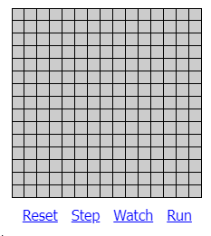
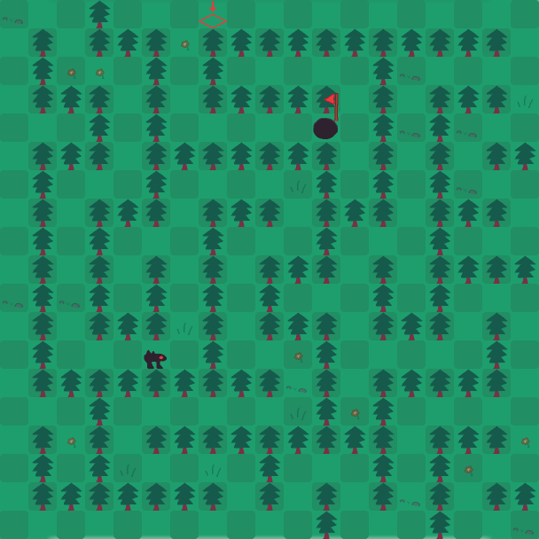
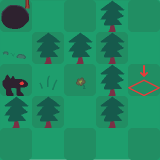
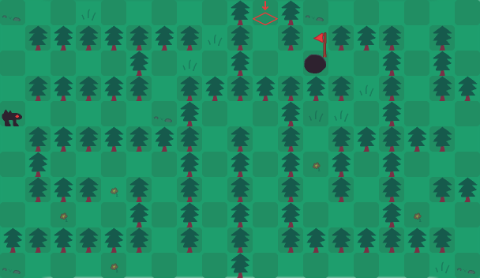
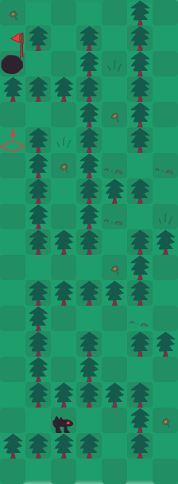

# Rapport Chasse au Monstre

## Génération de labyrinthe

### Présentation de l'algorithme

Pour cette SAÉ, nous avons choisis l'algorithme *Recursive Backtracing*. Comme son nom l'indique, c'est un algorithme recursif qui retourne sur ses pas (backtracing).

C'est un algorithme que nous avons choisis pour plusieurs raisons:
- L'algorithme est très simple a implementé (malgré le fait qu'il soit récursif)
- L'algorithme est rapide sur n'importe quelle taille de labyrinthe, carré ou rectangulaire.
- C'est un algorithme que je connais, ayant déjà eu l'occassion de l'implementé au S1 lors de la SAÉ du jeu ludo-pédadogique.

Néanmoins, comme **points négatifs** on peut souligner que:

- Certaines cases seront tout le temps des obstacles (les cases ou les coordonnées sont tous les deux impairs), ce qui réduit de 25% les cases à surveiller pour le chasseur.
- Le monstre et la sortie ne commençant jamais à la même position pour ne pas permettre au chasseur de gagner au premier tour, ce qui peut grandement avantager le monstre si il commence près de la sortie.
- Sur des labyrinthes très grands, le fait qu'il n'existe qu'un seul et unique chemin vers la sortie peut rendre l'expérience frustrante lors qu'il rencontre une impasse.

L'algorithme du labyrinthe se trouve dans la classe `src\main\java\fr\univlille\Maze.java`. Une classe de test se trouve également dans `src\main\tests\fr\univlille\TestMaze.java`.

### Fonctionnement de l'algorithme

- L'algorithme est un algorithme recursif. À chaque appel, il va regarder dans les quatre cases autour de lui. Si les cases ne sont pas exploré, alors il va appeler la méthode dans cette case, etc... Au final, toutes les cases du labyrinthe seront explorés, et aucune case sera innacessible. Il n'existe qu'un seul et unique chemin de l'entrée à la sortie.

### Explication de l'algorithme

- Voici l'algorithme en pseudo-code (le code dans la classe Java est très similaire):

```py
fonction recursiveBacktrack(currentX, currentY):
    directions = [[0, -2], [0, 2], [-2, 0], [2, 0]] # Les 4 directions possible (gauche, droite, haut, bas).
    # Ici, on utilise des directions de longueur 2, car dans le jeu, les murs sont solides et sont considérés comme des cases.
    mélanger(directions) # On mélange aléatoirement les 4 directions

    pour chaque direction de directions:
        # On calcule la nouvelle position x et y
        newX = currentX + direction[0]
        newY = currentY + direction[1]

        # On vérifie d'abord si la case est dans la zone de jeu (c'est à dire qu'elle est comprise entre 0 et la taille du labyrinthe).
        # Puis si la case n'a pas déjà été visité.
        si (newX >= 0 et newX < tailleX et newY >= 0 et newY < tailleY) et maze[newY][newX]
            # On ouvre le mur entre la nouvelle case et la case précedente.
            maze[currentY + direction[1] / 2][currentX + direction[0] / 2] = faux
            
            # Marque la nouvelle case comme visitée
            maze[newY][newX] = faux

            # Appel récursif pour explorer la nouvelle cellule
            recursiveBacktrack(newX, newY)
        fin si
    fin pour
fin fonction
```

- Dans `Maze.java`, nous utilisons également une seed pour génerer le labyrinthe. Notre jeu ayant du multijoueur en ligne, cela permet aux deux utilisateurs de partager la même carte. Dans notre jeu, une mécanique s'appellant le "SuperJump" permet au monstre de sauter par dessus un arbre pour faciliter la navigation dans le labyrinthe.

- Voici une animation illustrant cette algorithme. Dans l'exemple, les murs sont des simples traits, tandis que dans notre projet les murs sont des cases entières.



> L'illustration vient du site [jamisbuck.org](https://weblog.jamisbuck.org/2010/12/27/maze-generation-recursive-backtracking)

### Captures d'écran

- Voici des captures d'écrans d'exemple de génération du labyrinthe pour notre jeu:

- Un labyrinthe carré de taille 19x19 (la taille maximale dans le jeu, non pas pour des raisons de perfomances ou d'éfficacité mais simplement car sinon le jeu devient impossible pour le chasseur):



- Un labyrinthe de taille 5x5, la taille minimum:



- Deux labyrinthes rectangulaire.


